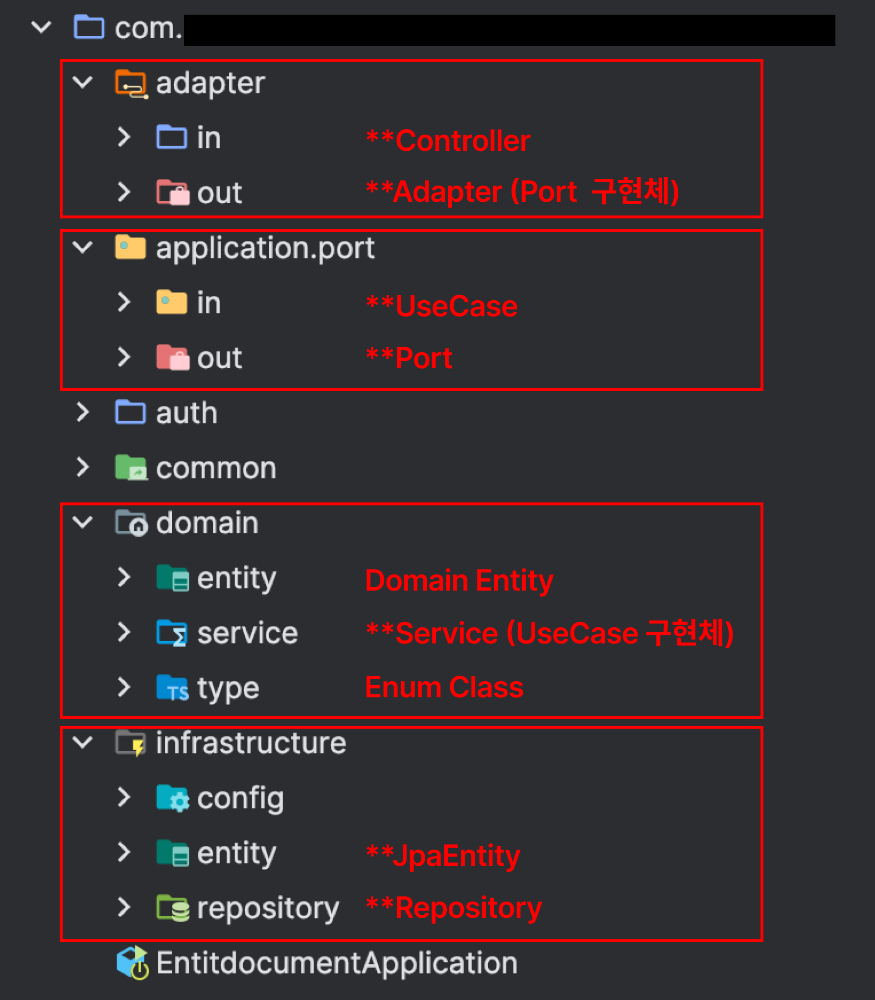

# 목차

- [목차](#목차)
- [주요 기술 스택](#주요-기술-스택)
- [Hexagonal Architecture](#hexagonal-architecture)
- [기능 명세](#기능-명세)
    - [Working (수행 워킹)](#working-수행-워킹)
    - [WorkingDocument (워킹 문서)](#workingdocument-워킹-문서)
    - [Review (문서 리뷰)](#review-문서-리뷰)
    - [CpEvaluation (CP 기여도 평가)](#cpevaluation-cp-기여도-평가)

# 주요 기술 스택

| 기술                 | 버전      |
|--------------------|---------|
| Java               | 17      |
| Spring Boot        | 3.2.4   |
| Spring Data JPA    | 3.2.4   |
| Spring Security    | 6.2.3   |
| QueryDSL           | 5.0.0   |
| MySQL              | 8.2.0   |
| MySQL Connector    | 8.3.0   |
| H2 Database (test) | 2.2.224 |

# Hexagonal Architecture

### 패키지 구조

# 기능 명세

> 이미 만들어진 기능에 대한 기능 명세는 생략한다. (로그인, Working 등록 및 조회 등)

### Working (수행 워킹)

- [x] Working은 작성자, 담당자, 기여도(cp), 제목, 내용, 삭제 여부, 상태, 종류, 마감일, 지원 마감일을 갖는다.
- [x] 담당자를 제외한 모든 정보는 필수로 입력해야 한다.
- [x] 완료 여부를 체크할 수 있다.
- [x] Working은 등록이 가능하다.
- [x] Working은 담당자 등록이 가능하다.
- [x] Working은 삭제가 가능하다. (삭제 여부를 true로 변경)

### WorkingDocument (워킹 문서)

- [x] 팀 멤버가 새로운 WorkingDocument를 등록한다.
    - [x] 제목을 입력한다.
    - [x] 내용을 입력한다.
    - [x] Working을 입력한다.
        - [x] 본인이 수행한 Working에 대한 WorkingDocument만 등록 가능하다.
        - [x] Working이 '대기중' 상태이면 등록 불가능하다.
    - [x] 문서 링크 종류를 선택한다.
        - [x] 링크 종류는 confluence, gitlab 2가지 종류가 존재한다.
    - [x] 링크를 입력한다.
    - [x] 리뷰 요청할 리뷰어를 선택한다.
        - [x] 1개의 WorkingDocument에 대한 리뷰어는 파트리더 2명과 팀 멤버 1명 이상을 가진다.
- [x] 등록 완료하면 '검토중' 상태로 초기화 된다.
- [x] 리뷰어 N명도 함께 생성된다.

- [x] 본인이 등록한 WorkingDocument를 수정 및 삭제한다.
    - [x] 리뷰가 없을 경우에만 가능하며, 리뷰가 존재할 경우 불가능하다.

- [x] 팀 멤버가 본인이 작성한 전체 WorkingDocument 목록을 조회한다.
- [x] 파트 리더/팀 리더가 팀의 전체 WorkingDocument 목록을 조회한다.
- [x] 팀 멤버/파트 리더/팀 리더가 리뷰 요청 받은 전체 WorkingDocument 목록을 조회한다.
- [x] 팀 멤버/파트 리더/팀 리더가 WorkingDocument 상세 조회를 한다.
- [x] 팀 멤버/파트 리더/팀 리더가 WorkingDocument 전체 리뷰를 조회한다.
    - [x] 팀 멤버는 작성자 본인만 조회 가능하다.
- [x] 팀 멤버/파트 리더/팀 리더가 본인이 남긴 리뷰를 조회한다.
    - [x] 리뷰 작성자만 조회 가능하다.
- [x] 팀 멤버가 승인 완료된 WorkingDocument의 최종 기여도를 조회한다.

### Review (문서 리뷰)

- [x] 팀 멤버/파트 리더는 리뷰 요청을 받은 WorkingDocument에 대해 리뷰를 남긴다.
    - [x] 리뷰는 '명확성', '일관성', '완성도' 3가지 문항이 존재한다.
    - [x] '좋아요', '보통', '아쉬워요' 3가지로 응답한다.
    - [x] 지정된 리뷰어가 아닌 경우, 리뷰를 남길 수 없다.
- [x] 내가 등록한 리뷰를 조회한다.
- [x] 내가 등록한 리뷰를 수정 및 삭제한다.
    - [x] WorkingDocument 상태가 '검토중'일 때만 가능하다.
- [x] 팀 멤버/파트 리더/팀 리더는 WorkingDocument의 전체 리뷰를 조회한다.

### CpEvaluation (CP 기여도 평가)

- [x] 파트 리더/팀 리더는 요청 받은 WorkingDocument에 대해 CP를 평가한다.
    - [x] 파트리더는 리뷰를 완료하지 않으면 cp 승인 요청을 보낼 수 없다.
    - [x] 팀 리더는 파트리더가 요청을 보내지 않아도 승인 완료가 가능해야 한다.
    - [x] 본인이 책정한 기여도(cp)를 입력한다.
    - [x] 파트 리더 <-> 팀 리더 간 책정한 cp에 대하여 코멘트를 남길 수 있다.
- [x] 팀 멤버는 CpEvaluation 내용을 조회할 수 없다.
    - [x] WorkingDocument 작성자인 팀 멤버는 리더의 최종 기여도만 조회 가능하다.

